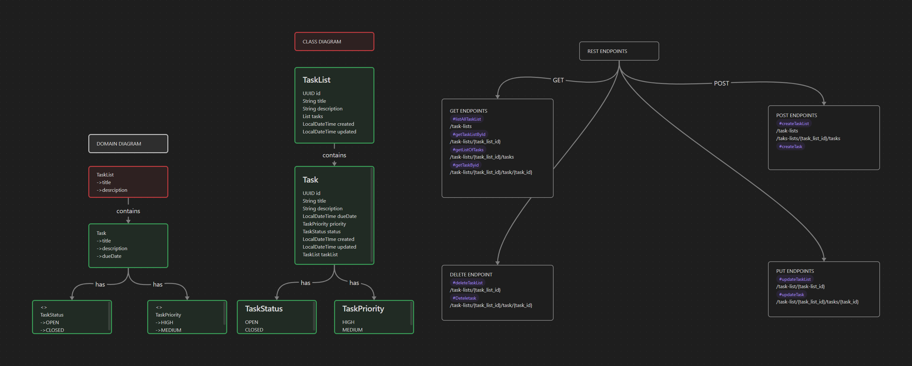

# 🚀 Spring Boot Backend Projects

This repository contains two Java Spring Boot backend projects:

1. **🗓 Task Tracker API** - A RESTful API to manage tasks.
2. **🔐 JWT Role-Based Authentication API** - Secure user login system with JWT and role-based access control.

---

## 🗂 Project 1: Task Tracker API (Spring Boot)

### 📌 Description
A simple CRUD-based RESTful web service for managing tasks. Built using Spring Boot following best practices such as:
- Layered architecture (Controller, Service, Repository,Mappers,Global Exception Handler)
- DTO usage
- Entity relationships
- Rest Apis
- Global Exception Handler
- MVC design pattern.

### 🛠 Technologies Used
- Java 17+
- Spring Boot
- Spring Data JPA
- H2 / MySQL
- Lombok
- 
###RelationShip
We have 2 entity one is tasklist and the other one is tasks so. One task list can have many task associated with it
there by forming @OneToMany with Task and Task have ManyToOne RelationShip with TaskList


###Diagrams

### 🔁 Endpoints

| Method | Endpoint         | Description         |
|--------|------------------|---------------------|
| GET    | `/task-list/{task_list_id}/task`         | Get all tasks       |
| GET    | `/task-list/{task_list_id}/task`    | Get task by ID      |
| POST   | `/task-list/{task_list_id}/task`        | Create a task       |
| PUT    | `/task-list/{task_list_id}/task`    | Update a task       |
| DELETE | `/task-list/{task_list_id}/task`    | Delete a task       |
| GET    | `/task-list/`     | Get all tasklist    |
| POST   |`/task-list/`      | Create a TaskList   |
| PUT    |`/task-list/{taskListId}` | Update Tasklist     |
|DELETE |`task-list/{task-list-id}`|Delete task list|

### 🔗 Acess Endpoints.
Access API docs at:  
`http://localhost:8080/`

---

## 🔐 Project 2: JWT Role-Based Auth API

### 📌 Description
A secure backend login/register system with:
- JWT token-based authentication
- Role-based access (USER, ADMIN)
- Spring Security integration

### 🛠 Technologies Used
- Java 17+
- Spring Boot
- Spring Security
- JWT (io.jsonwebtoken)
- H2 / MySQL
- Lombok

### 📦 API Endpoints

| Method | Endpoint        | Description                |
|--------|-----------------|----------------------------|
| POST   | `/auth/register`| Register a new user        |
| POST   | `/auth/login`   | Authenticate and get token |
| GET    | `/api/protext-data`    | User-only endpoint         |

### 🔐 Roles
- `ROLE_USER` – can access his content
- `ROLE_ADMIN` – can access admin specfic content

---

## 📦 Running the Project

```bash
# Clone repo
git clone https://github.com/guruprasath-og/springcodes
cd your-repo-name

# Build & run
./mvnw spring-boot:run

